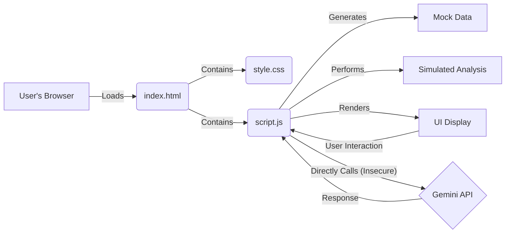

# Alps Education AI Prototype

## Overview

This project is a functional web prototype demonstrating potential AI-powered capabilities for the Alps Education platform, inspired by Alps Connect and related use cases. It aims to showcase how AI can provide actionable insights for school leaders and teachers regarding student performance, predictions, benchmarking, and data exploration via a chat interface.

**Note:** This is a prototype using mock data and simulated analyses. The AI chat feature uses a real API key embedded directly in the frontend code, which is **highly insecure** and done for demonstration purposes only.

## Requirements Demonstrated

This prototype demonstrates the following core capabilities:

1.  **AI-Driven Student Performance Prediction & Intervention:** Identifying students needing support to reach target grades and suggesting interventions.
2.  **Predictive Analytics for Exam Performance:** Highlighting subjects potentially at risk of underperforming in upcoming exams based on current trends.
3.  **Smart Teacher Dashboard:** Providing teachers with a quick overview of class performance, engagement indicators, and students requiring attention.
4.  **AI-Driven School Benchmarking & Performance Analysis:** Summarizing multi-year school performance trends and comparing them against simulated national benchmarks.
5.  **LLM Chat Interface for Data Exploration:** Allowing users to ask natural language questions about the data presented within each section, using Google's Gemini model.

## Demonstration in Application

The requirements are demonstrated in the corresponding tabs of the web interface (`index.html`):

*   **Prediction & Intervention:** "Student Intervention" tab.
*   **Exam Prediction:** "Exam Prediction" tab.
*   **Teacher Dashboard:** "Teacher Dashboard" tab.
*   **Benchmarking:** "School Benchmarking" tab.
*   **LLM Chat:** The integrated chat box ("Chat about X Data") within each of the above tabs.

## Assumptions Made

*   **Mock Data:** All student data (names, subjects, grades, scores, engagement metrics, ALPS grades/scores) is randomly generated within `script.js` for demonstration. It does not represent real individuals or performance. ALPS calculations are highly simplified placeholders.
*   **Simulated Analysis:** The core analyses (gap analysis, risk assessment, trends, benchmarking comparisons) use simplified placeholder logic in JavaScript. They are illustrative and not based on validated educational models or real ALPS algorithms.
*   **API Key Security:** The Google Gemini API key is embedded directly in the frontend JavaScript (`script.js`). **This is insecure and unsuitable for any shared or production environment.** In a real application, API keys must be handled securely via a backend server.
*   **Local Server Environment:** The prototype requires being served via a local web server (e.g., `python3 -m http.server 8000` or `npx http-server -p 8000`) because browsers restrict loading JavaScript modules (`type="module"`) from local `file:///` paths due to CORS policy.
*   **LLM Context & Prompting:** The context provided to the Gemini model is a basic summary of the mock data and currently displayed UI elements. Production systems would need more sophisticated context generation and prompt engineering for optimal results. Formatting requests (like using tables) are best-effort suggestions to the LLM.

## Data Sourcing (Current Prototype)

The prototype uses **mock data** generated entirely within the `script.js` file when the `index.html` page is loaded in the browser. No external data sources, databases, or APIs (other than the Gemini chat API) are connected or used.

## Current Prototype Architecture

The prototype employs a simple, frontend-only architecture suitable only for local demonstration:

*   **HTML (`index.html`):** Defines the structure and content layout.
*   **CSS (`style.css`):** Defines the visual presentation.
*   **JavaScript (`script.js`):**
    *   Generates mock data.
    *   Performs all simulated analysis logic.
    *   Handles UI interactions (tab switching, button clicks).
    *   Renders results to the HTML DOM.
    *   Directly calls the Google Gemini API (insecurely) for the chat feature.



## Proposed Production Architecture

A robust, scalable, and secure production architecture would look significantly different:

*   **Frontend:** A modern JavaScript framework (e.g., React, Vue, Angular) for building a component-based UI, managing application state, and enabling efficient rendering. Hosted statically (e.g., AWS S3 + CloudFront, Netlify, Vercel, Azure Static Web Apps).
*   **Backend API:** Microservices or a modular monolith (e.g., using Node.js/Express, Python/Django/Flask, Go/Gin) responsible for:
    *   Handling business logic.
    *   User authentication and authorization.
    *   Data validation.
    *   Securely interacting with the database and other services.
    *   Acting as a secure gateway for AI API calls.
    *   Hosted using container orchestration (Kubernetes, AWS ECS, Google Cloud Run) or serverless functions (AWS Lambda, Azure Functions).
*   **Database:** A managed relational database (e.g., PostgreSQL via AWS RDS, Azure SQL, Google Cloud SQL) is likely suitable for structured educational data, potentially with read replicas for scaling query load. Consider NoSQL options (MongoDB, DynamoDB) if data structures are highly variable.
*   **Data Processing/AI Engine:** Separate, potentially asynchronous service(s) (e.g., Python using Pandas, Scikit-learn, PyTorch/TensorFlow) for:
    *   Running complex statistical analyses and ALPS calculations.
    *   Training and serving custom predictive models.
    *   Handling computationally intensive tasks offloaded via a task queue (e.g., Celery with RabbitMQ/Redis, AWS SQS).
    *   Securely interacting with external AI APIs (like Gemini) via the backend API gateway.
*   **Authentication/Authorization:** A dedicated identity provider (e.g., Auth0, AWS Cognito, Azure AD B2C) or a well-secured custom implementation using standards like OAuth 2.0 / OpenID Connect and JWTs.
*   **Hosting Platform:** A major cloud provider (AWS, Azure, GCP) offering managed services for databases, compute, storage, networking, and security.

```mermaid
graph TD
    A[User Browser] -- HTTPS --> B(Load Balancer / CDN);
    B --> C{Frontend (React/Vue/Angular)};
    C -- API Calls (HTTPS) --> D[API Gateway];
    D --> E{Backend API Service(s) (Node/Python/Go)};
    E -- AuthN/AuthZ --> F[Auth Service (Cognito/Auth0/Azure AD)];
    E -- CRUD Ops --> G[Database (PostgreSQL/RDS)];
    E -- Async Task --> H{Task Queue (SQS/RabbitMQ)};
    H --> I[Data Processing / AI Engine (Python)];
    I --> G;
    I -- Secure Call via Backend --> J{External AI API (Gemini)};
    J -- Response --> I;
    subgraph Cloud Platform (AWS/Azure/GCP)
        direction LR
        B; C; D; E; F; G; H; I;
    end
```

## Ethical Guardrails (EU AI Act - High-Risk Considerations)

Educational AI systems, especially those involving performance prediction and intervention suggestions, are likely to be classified as **High-Risk** under the EU AI Act. Implementing robust ethical guardrails is crucial:

1.  **Transparency & Explainability:**
    *   Provide clear explanations for AI-driven suggestions (e.g., "Student X flagged due to declining mock scores in Subject Y and predicted grade below target Z"). Use techniques like LIME or SHAP for model explainability where feasible.
    *   Document model limitations, potential biases, and confidence levels clearly for educators.
    *   Maintain clear data lineage and processing logs.
2.  **Bias Detection & Mitigation:**
    *   Regularly audit input data and model outputs for biases related to protected characteristics (gender, ethnicity, socioeconomic background, SEN status, etc.).
    *   Employ fairness metrics and mitigation techniques (e.g., data re-sampling, algorithmic adjustments) during model development and monitoring.
3.  **Human Oversight & Agency:**
    *   **Crucially, the AI must be positioned as a decision-support tool, not a decision-maker.** Educators must retain final authority on interventions, assessments, and student support.
    *   Design interfaces that allow educators to easily review, override, or ignore AI suggestions.
    *   Provide training to users on the system's capabilities and limitations.
4.  **Data Privacy & Security (GDPR Compliance):**
    *   Implement strict role-based access controls (RBAC) to ensure users only see data relevant to their role.
    *   Employ data minimization – collect and process only necessary data.
    *   Use anonymization or pseudonymization techniques where possible, especially for aggregated analysis and model training.
    *   Ensure robust data encryption (at rest and in transit).
    *   Conduct regular security audits and penetration testing.
    *   Securely manage all API keys and credentials via backend services.
5.  **Accuracy, Robustness & Reliability:**
    *   Implement rigorous testing methodologies, including validation against historical data, edge case testing, and potentially adversarial testing.
    *   Continuously monitor model performance in production for drift or degradation. Implement mechanisms for retraining or updating models.
    *   Clearly communicate the confidence or probability associated with predictions.
6.  **Accountability & Governance:**
    *   Establish clear governance structures defining responsibility for the AI system's development, deployment, and monitoring.
    *   Maintain detailed documentation of the system's design, data sources, models, and validation processes.
    *   Implement mechanisms for users to report issues or contest AI-driven suggestions.
7.  **Child Safety:**
    *   Ensure all aspects of the system comply with relevant child protection regulations.
    *   Design interfaces and explanations that are appropriate for educators working with minors.

## Ongoing Cost Estimation (Detailed)

*   **Disclaimer:** These are *estimates* based on publicly available pricing (primarily AWS London region `eu-west-2`, March 2025 approx. pricing) and usage assumptions. Actual costs will vary based on specific usage patterns, chosen service tiers, optimizations, negotiated discounts, and future price changes. Personnel costs (DevOps, SRE, Data Science) are excluded.
*   **Scale Assumptions:** 30,000 users (students/teachers/leaders), 1200 customers (schools), ~1TB database size (growing), moderate analysis/chat usage.
*   **Breakdown:**

    | Service Category          | Example Service(s) (AWS eu-west-2) | Unit Cost Assumption (Approx. Mar 2025)                                  | Estimated Monthly Usage Assumption                                                                 | Estimated Monthly Cost (GBP) | Notes                                                                                                |
    | :------------------------ | :--------------------------------- | :----------------------------------------------------------------------- | :------------------------------------------------------------------------------------------------- | :--------------------------- | :--------------------------------------------------------------------------------------------------- |
    | **Compute (Backend/AI)**  | AWS Fargate / EC2 Auto Scaling     | Fargate: £0.035/vCPU-hr + £0.0038/GB-hr. EC2 (m5.xlarge): £0.17/hr (OnDemand) | Equivalent to 10-20 vCPU & 40-80GB RAM continuous avg (blend of steady + peak AI load)             | £550 - £1,500                | Serverless (Fargate) or optimized EC2 (Reserved/Savings Plan) recommended. Highly usage-dependent. |
    | **Database (Primary)**    | AWS RDS PostgreSQL (Multi-AZ)      | `db.m5.xlarge` (4vCPU/16GB): £0.35/hr per instance                       | 1 Primary + 1 Replica instance (High Availability)                                                 | £510                         | Cost for compute instances.                                                                          |
    | **Database (Storage/IO)** | RDS Storage (gp3 SSD)              | Storage: £0.10/GB-month. IOPS: ~£0.005/IOPS-month (beyond 3k free)      | 1TB Storage + 4000 Provisioned IOPS                                                                | £105                         | (1000GB * £0.10) + ((4000-3000) IOPS * £0.005).                                                      |
    | **Object Storage**        | AWS S3 Standard                    | £0.02 / GB-month                                                         | 500 GB (backups, logs, assets - growing)                                                           | £10 - £50                    | Relatively low cost unless storing very large media/datasets.                                        |
    | **Bandwidth**             | AWS Data Transfer Out              | ~£0.07 / GB (after first 100GB free)                                     | 5 TB / month                                                                                       | £340 - £600                  | Highly variable based on API usage, data size, asset delivery.                                       |
    | **Monitoring/Logging**    | AWS CloudWatch / Datadog etc.      | Tiered pricing based on metrics, logs, traces                            | Standard operational monitoring                                                                    | £150 - £500                  | Essential for observability. Cost depends on granularity.                                            |
    | **AI API Calls**          | Google Gemini API                  | `gemini-1.5-flash-latest` (proxy): ~£0.0001/1k char (in), £0.0003/1k char (out) | 15k active users/mo * 20 chats/user * 3k avg chars/chat (~900M total chars/mo)                     | £150 - £1,500                | **Highly variable.** Depends heavily on usage, prompt size, model choice. Flash models are cheaper. |
    | **Other Services**        | AWS Cognito, CloudFront, Route 53  | Tiered/Usage-based                                                       | Authentication, CDN for frontend, DNS                                                              | £50 - £200                   | Cognito/Auth0 free tiers might cover initial usage.                                                  |
    | **TOTAL ESTIMATED**       |                                    |                                                                          |                                                                                                    | **~£1,865 - £4,915+ / month** | **Excludes personnel. Significant variance possible based on actual usage and optimization.**        |

*   **Cost Drivers & Scaling:**
    *   The primary drivers will likely be **Compute** (especially during peak analysis/AI tasks) and **AI API Calls**. Careful monitoring and optimization are key.
    *   Database costs will scale with data size and query load (requiring larger instances/more IOPS). Consider partitioning or sharding strategies long-term.
    *   Optimizations like using reserved instances/savings plans for compute/DB, caching strategies (e.g., Redis/ElastiCache), and efficient AI prompt engineering will be crucial for managing costs at scale.
    *   This estimate assumes efficient architecture; poorly optimized code or queries could inflate costs significantly. Pricing the service requires factoring in these infrastructure costs, personnel, development, support, and desired margin.

## Phased Implementation Plan

This outlines a potential roadmap for developing a production-ready version:

*   **Phase 1: Foundation & Core MVP (3-6 months)**
    *   *Focus:* Secure backend infrastructure (cloud setup, VPC, basic security groups), database schema design and setup, user/school authentication & authorization (basic roles), secure data ingestion pipeline (e.g., validated CSV uploads), core Student Intervention & Exam Prediction features (using robust statistical calculations or initial simple models), essential teacher/admin dashboards displaying ingested data and basic analysis results. Implement core ethical logging.
    *   *OKRs:* Launch MVP to 3-5 pilot schools; Securely ingest and process data for 1000+ students; Achieve >80% accuracy on core prediction metric (defined against historical data); Establish secure data handling protocols & pass initial security review.
    *   *Team Structure:* 1 Product Manager, 2 Backend Developers, 1 Frontend Developer, 0.5 DevOps/Cloud Engineer, 0.5 QA Engineer.
    *   *Skills Needed:* Cloud Infrastructure (AWS/Azure/GCP), Backend Framework (Node/Python/Go), Database (SQL), Frontend Framework (React/Vue/etc.), Authentication, CI/CD, Basic Security Practices, QA Testing.

*   **Phase 2: Feature Enrichment & Secure AI Chat (6-9 months post-Phase 1)**
    *   *Focus:* Add School Benchmarking features (requiring aggregated/anonymized data handling), enhance Teacher Dashboard with more detailed views and engagement metrics (if sourced), build secure backend integration for the Gemini chat feature (proxying API calls), refine UI/UX based on pilot feedback, develop basic reporting features (e.g., exportable summaries). Begin bias audits.
    *   *OKRs:* Onboard additional 20-30 schools; Achieve >70% weekly active usage for key features among pilot users; User satisfaction score (teachers/leaders) > 4.0/5.0; Launch secure chat feature with basic context awareness; Complete first AI bias audit report.
    *   *Team Structure:* Add 1 UI/UX Designer, 1 Data Scientist/Analyst. Strengthen QA.
    *   *Skills Needed:* + UI/UX Design, Data Analysis (Pandas/SQL), Basic LLM Integration, Data Visualization Libraries, Advanced QA.

*   **Phase 3: Scaling, Optimization & Advanced AI (9-12+ months post-Phase 2)**
    *   *Focus:* Optimize database queries and backend performance for scale (target 1200 schools/30k users), implement robust monitoring, logging, and alerting (observability), enhance AI model accuracy, develop explainability features for AI suggestions, build advanced/customizable reporting capabilities, implement stricter ethical guardrails & automated auditing tools, explore more sophisticated data integrations (e.g., MIS sync).
    *   *OKRs:* Successfully serve 500+ schools with target performance SLAs (<500ms API response P95); Reduce infrastructure cost per active user by 10% through optimization; Implement and document AI explainability for key predictions; Demonstrate compliance with relevant sections of EU AI Act (via internal audit).
    *   *Team Structure:* Strengthen DevOps/SRE team (2+), potentially add more Data Scientists/ML Engineers, consider dedicated Security Engineer.
    *   *Skills Needed:* + Performance Optimization (DB indexing, caching, load testing), Advanced Cloud Architecture (scaling, resilience), Observability Tools (Datadog, Grafana, etc.), MLOps, AI Ethics & Explainability Techniques, Advanced Security Practices.
# avkalan


