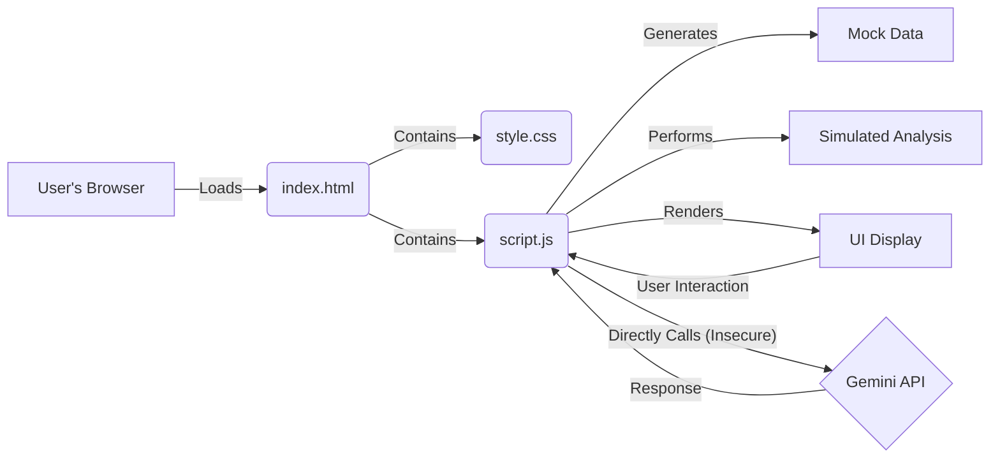
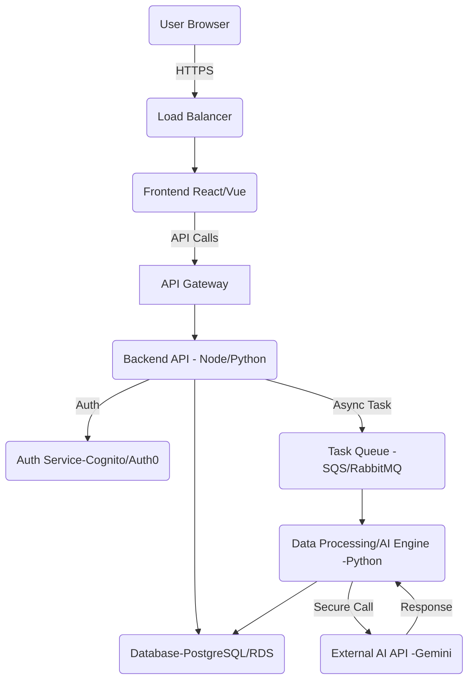

# Alps Education AI Prototype

## Overview

This project is a functional web prototype demonstrating potential AI-powered capabilities for the Alps Education platform, inspired by Alps Connect and related use cases. It aims to showcase how AI can provide actionable insights for school leaders and teachers regarding student performance, predictions, benchmarking, and data exploration via a chat interface.

**Note:** This is a prototype using mock data and simulated analyses. The AI chat feature now fetches the API key securely from a local backend server (Flask), which loads the key from a `.env` file. **Never hardcode API keys in frontend code or commit them to version control.**

## Requirements Demonstrated

This prototype demonstrates the following core capabilities:

1.  **AI-Driven Student Performance Prediction & Intervention:** Identifying students needing support to reach target grades and suggesting interventions.
2.  **Predictive Analytics for Exam Performance:** Highlighting subjects potentially at risk of underperforming in upcoming exams based on current trends.
3.  **Smart Teacher Dashboard:** Providing teachers with a quick overview of class performance, engagement indicators, and students requiring attention.
4.  **AI-Driven School Benchmarking & Performance Analysis:** Summarizing multi-year school performance trends and comparing them against simulated national benchmarks.
5.  **LLM Chat Interface for Data Exploration:** Allowing users to ask natural language questions about the data presented within each section, using Google's Gemini model.

## Demonstration in Application

The requirements are demonstrated in the corresponding tabs of the web interface (`index.html`):

*   **Prediction & Intervention:** "Student Intervention" tab.
*   **Exam Prediction:** "Exam Prediction" tab.
*   **Teacher Dashboard:** "Teacher Dashboard" tab.
*   **Benchmarking:** "School Benchmarking" tab.
*   **LLM Chat:** The integrated chat box ("Chat about X Data") within each of the above tabs.

## Assumptions Made

*   **Mock Data:** All student data (names, subjects, grades, scores, engagement metrics, ALPS grades/scores) is randomly generated within `script.js` for demonstration. It does not represent real individuals or performance. ALPS calculations are highly simplified placeholders.
*   **Simulated Analysis:** The core analyses (gap analysis, risk assessment, trends, benchmarking comparisons) use simplified placeholder logic in JavaScript. They are illustrative and not based on validated educational models or real ALPS algorithms.
*   **API Key Security:** The Google Gemini API key is now loaded securely from a backend Flask server and never hardcoded in the frontend. **This is the recommended approach for any real or shared environment.**
*   **Local Server Environment:** The prototype requires being served via a local web server (e.g., `python3 -m http.server 8000` or `npx http-server -p 8000`) because browsers restrict loading JavaScript modules (`type="module"`) from local `file:///` paths due to CORS policy.
*   **LLM Context & Prompting:** The context provided to the Gemini model is a basic summary of the mock data and currently displayed UI elements. Production systems would need more sophisticated context generation and prompt engineering for optimal results. Formatting requests (like using tables) are best-effort suggestions to the LLM.

## Data Sourcing (Current Prototype)

The prototype uses **mock data** generated entirely within the `script.js` file when the `index.html` page is loaded in the browser. No external data sources, databases, or APIs (other than the Gemini chat API) are connected or used.

## Current Prototype Architecture

The prototype employs a simple, frontend-only architecture suitable only for local demonstration:

*   **HTML (`index.html`):** Defines the structure and content layout.
*   **CSS (`style.css`):** Defines the visual presentation.
*   **JavaScript (`script.js`):**
    *   Generates mock data.
    *   Performs all simulated analysis logic.
    *   Handles UI interactions (tab switching, button clicks).
    *   Renders results to the HTML DOM.
    *   Directly calls the Google Gemini API (insecurely) for the chat feature.



## Proposed Production Architecture

A robust, scalable, and secure production architecture would look significantly different:

*   **Frontend:** A modern JavaScript framework (e.g., React, Vue, Angular) for building a component-based UI, managing application state, and enabling efficient rendering. Hosted statically (e.g., AWS S3 + CloudFront, Netlify, Vercel, Azure Static Web Apps).
*   **Backend API:** Microservices or a modular monolith (e.g., using Node.js/Express, Python/Django/Flask, Go/Gin) responsible for:
    *   Handling business logic.
    *   User authentication and authorization.
    *   Data validation.
    *   Securely interacting with the database and other services.
    *   Acting as a secure gateway for AI API calls.
    *   Hosted using container orchestration (Kubernetes, AWS ECS, Google Cloud Run) or serverless functions (AWS Lambda, Azure Functions).
*   **Database:** A managed relational database (e.g., PostgreSQL via AWS RDS, Azure SQL, Google Cloud SQL) is likely suitable for structured educational data, potentially with read replicas for scaling query load. Consider NoSQL options (MongoDB, DynamoDB) if data structures are highly variable.
*   **Data Processing/AI Engine:** Separate, potentially asynchronous service(s) (e.g., Python using Pandas, Scikit-learn, PyTorch/TensorFlow) for:
    *   Running complex statistical analyses and ALPS calculations.
    *   Training and serving custom predictive models.
    *   Handling computationally intensive tasks offloaded via a task queue (e.g., Celery with RabbitMQ/Redis, AWS SQS).
    *   Securely interacting with external AI APIs (like Gemini) via the backend API gateway.
*   **Authentication/Authorization:** A dedicated identity provider (e.g., Auth0, AWS Cognito, Azure AD B2C) or a well-secured custom implementation using standards like OAuth 2.0 / OpenID Connect and JWTs.
*   **Hosting Platform:** A major cloud provider (AWS, Azure, GCP) offering managed services for databases, compute, storage, networking, and security.



## Ethical Guardrails (EU AI Act - High-Risk Considerations)

Educational AI systems, especially those involving performance prediction and intervention suggestions, are likely to be classified as **High-Risk** under the EU AI Act. Implementing robust ethical guardrails is crucial:

1.  **Transparency & Explainability:**
    *   Provide clear explanations for AI-driven suggestions (e.g., "Student X flagged due to declining mock scores in Subject Y and predicted grade below target Z"). Use techniques like LIME or SHAP for model explainability where feasible.
    *   Document model limitations, potential biases, and confidence levels clearly for educators.
    *   Maintain clear data lineage and processing logs.
2.  **Bias Detection & Mitigation:**
    *   Regularly audit input data and model outputs for biases related to protected characteristics (gender, ethnicity, socioeconomic background, SEN status, etc.).
    *   Employ fairness metrics and mitigation techniques (e.g., data re-sampling, algorithmic adjustments) during model development and monitoring.
3.  **Human Oversight & Agency:**
    *   **Crucially, the AI must be positioned as a decision-support tool, not a decision-maker.** Educators must retain final authority on interventions, assessments, and student support.
    *   Design interfaces that allow educators to easily review, override, or ignore AI suggestions.
    *   Provide training to users on the system's capabilities and limitations.
4.  **Data Privacy & Security (GDPR Compliance):**
    *   Implement strict role-based access controls (RBAC) to ensure users only see data relevant to their role.
    *   Employ data minimization – collect and process only necessary data.
    *   Use anonymization or pseudonymization techniques where possible, especially for aggregated analysis and model training.
    *   Ensure robust data encryption (at rest and in transit).
    *   Conduct regular security audits and penetration testing.
    *   Securely manage all API keys and credentials via backend services.
5.  **Accuracy, Robustness & Reliability:**
    *   Implement rigorous testing methodologies, including validation against historical data, edge case testing, and potentially adversarial testing.
    *   Continuously monitor model performance in production for drift or degradation. Implement mechanisms for retraining or updating models.
    *   Clearly communicate the confidence or probability associated with predictions.
6.  **Accountability & Governance:**
    *   Establish clear governance structures defining responsibility for the AI system's development, deployment, and monitoring.
    *   Maintain detailed documentation of the system's design, data sources, models, and validation processes.
    *   Implement mechanisms for users to report issues or contest AI-driven suggestions.
7.  **Child Safety:**
    *   Ensure all aspects of the system comply with relevant child protection regulations.
    *   Design interfaces and explanations that are appropriate for educators working with minors.

## Ongoing Cost Estimation (Detailed)

*   **Disclaimer:** These are *estimates* based on publicly available pricing (primarily AWS London region `eu-west-2`, March 2025 approx. pricing) and usage assumptions. Actual costs will vary based on specific usage patterns, chosen service tiers, optimizations, negotiated discounts, and future price changes. Personnel costs (DevOps, SRE, Data Science) are excluded.
*   **Scale Assumptions:** 30,000 users (students/teachers/leaders), 1200 customers (schools), ~1TB database size (growing), moderate analysis/chat usage.
*   **Breakdown:**

    | Service Category          | Example Service(s) (AWS eu-west-2) | Unit Cost Assumption (Approx. Mar 2025)                                  | Estimated Monthly Usage Assumption                                                                 | Estimated Monthly Cost (GBP) | Notes                                                                                                |
    | :------------------------ | :--------------------------------- | :----------------------------------------------------------------------- | :------------------------------------------------------------------------------------------------- | :--------------------------- | :--------------------------------------------------------------------------------------------------- |
    | **Compute (Backend/AI)**  | AWS Fargate / EC2 Auto Scaling     | Fargate: £0.035/vCPU-hr + £0.0038/GB-hr. EC2 (m5.xlarge): £0.17/hr (OnDemand) | Equivalent to 10-20 vCPU & 40-80GB RAM continuous avg (blend of steady + peak AI load)             | £550 - £1,500                | Serverless (Fargate) or optimized EC2 (Reserved/Savings Plan) recommended. Highly usage-dependent. |
    | **Database (Primary)**    | AWS RDS PostgreSQL (Multi-AZ)      | `db.m5.xlarge` (4vCPU/16GB): £0.35/hr per instance                       | 1 Primary + 1 Replica instance (High Availability)                                                 | £510                         | Cost for compute instances.                                                                          |
    | **Database (Storage/IO)** | RDS Storage (gp3 SSD)              | Storage: £0.10/GB-month. IOPS: ~£0.005/IOPS-month (beyond 3k free)      | 1TB Storage + 4000 Provisioned IOPS                                                                | £105                         | (1000GB * £0.10) + ((4000-3000) IOPS * £0.005).                                                      |
    | **Object Storage**        | AWS S3 Standard                    | £0.02 / GB-month                                                         | 500 GB (backups, logs, assets - growing)                                                           | £10 - £50                    | Relatively low cost unless storing very large media/datasets.                                        |
    | **Bandwidth**             | AWS Data Transfer Out              | ~£0.07 / GB (after first 100GB free)                                     | 5 TB / month                                                                                       | £340 - £600                  | Highly variable based on API usage, data size, asset delivery.                                       |
    | **Monitoring/Logging**    | AWS CloudWatch / Datadog etc.      | Tiered pricing based on metrics, logs, traces                            | Standard operational monitoring                                                                    | £150 - £500                  | Essential for observability. Cost depends on granularity.                                            |
    | **AI API Calls**          | Google Gemini API                  | `gemini-1.5-flash-latest` (proxy): ~£0.0001/1k char (in), £0.0003/1k char (out) | 15k active users/mo * 20 chats/user * 3k avg chars/chat (~900M total chars/mo)                     | £150 - £1,500                | **Highly variable.** Depends heavily on usage, prompt size, model choice. Flash models are cheaper. |
    | **Other Services**        | AWS Cognito, CloudFront, Route 53  | Tiered/Usage-based                                                       | Authentication, CDN for frontend, DNS                                                              | £50 - £200                   | Cognito/Auth0 free tiers might cover initial usage.                                                  |
    | **TOTAL ESTIMATED**       |                                    |                                                                          |                                                                                                    | **~£1,865 - £4,915+ / month** | **Excludes personnel. Significant variance possible based on actual usage and optimization.**        |

*   **Cost Drivers & Scaling:**
    *   The primary drivers will likely be **Compute** (especially during peak analysis/AI tasks) and **AI API Calls**. Careful monitoring and optimization are key.
    *   Database costs will scale with data size and query load (requiring larger instances/more IOPS). Consider partitioning or sharding strategies long-term.
    *   Optimizations like using reserved instances/savings plans for compute/DB, caching strategies (e.g., Redis/ElastiCache), and efficient AI prompt engineering will be crucial for managing costs at scale.
    *   This estimate assumes efficient architecture; poorly optimized code or queries could inflate costs significantly. Pricing the service requires factoring in these infrastructure costs, personnel, development, support, and desired margin.

## Phased Implementation Plan

This outlines a potential roadmap for developing a production-ready version:

*   **Phase 1: Foundation & Core MVP (3-6 months)**
    *   *Focus:* Secure backend infrastructure (cloud setup, VPC, basic security groups), database schema design and setup, user/school authentication & authorization (basic roles), secure data ingestion pipeline (e.g., validated CSV uploads), core Student Intervention & Exam Prediction features (using robust statistical calculations or initial simple models), essential teacher/admin dashboards displaying ingested data and basic analysis results. Implement core ethical logging.
    *   *OKRs:* Launch MVP to 3-5 pilot schools; Securely ingest and process data for 1000+ students; Achieve >80% accuracy on core prediction metric (defined against historical data); Establish secure data handling protocols & pass initial security review.
    *   *Team Structure:* 1 Product Manager, 2 Backend Developers, 1 Frontend Developer, 0.5 DevOps/Cloud Engineer, 0.5 QA Engineer.
    *   *Skills Needed:* Cloud Infrastructure (AWS/Azure/GCP), Backend Framework (Node/Python/Go), Database (SQL), Frontend Framework (React/Vue/etc.), Authentication, CI/CD, Basic Security Practices, QA Testing.

*   **Phase 2: Feature Enrichment & Secure AI Chat (6-9 months post-Phase 1)**
    *   *Focus:* Add School Benchmarking features (requiring aggregated/anonymized data handling), enhance Teacher Dashboard with more detailed views and engagement metrics (if sourced), build secure backend integration for the Gemini chat feature (proxying API calls), refine UI/UX based on pilot feedback, develop basic reporting features (e.g., exportable summaries). Begin bias audits.
    *   *OKRs:* Onboard additional 20-30 schools; Achieve >70% weekly active usage for key features among pilot users; User satisfaction score (teachers/leaders) > 4.0/5.0; Launch secure chat feature with basic context awareness; Complete first AI bias audit report.
    *   *Team Structure:* Add 1 UI/UX Designer, 1 Data Scientist/Analyst. Strengthen QA.
    *   *Skills Needed:* + UI/UX Design, Data Analysis (Pandas/SQL), Basic LLM Integration, Data Visualization Libraries, Advanced QA.

*   **Phase 3: Scaling, Optimization & Advanced AI (9-12+ months post-Phase 2)**
    *   *Focus:* Optimize database queries and backend performance for scale (target 1200 schools/30k users), implement robust monitoring, logging, and alerting (observability), enhance AI model accuracy, develop explainability features for AI suggestions, build advanced/customizable reporting capabilities, implement stricter ethical guardrails & automated auditing tools, explore more sophisticated data integrations (e.g., MIS sync).
    *   *OKRs:* Successfully serve 500+ schools with target performance SLAs (<500ms API response P95); Reduce infrastructure cost per active user by 10% through optimization; Implement and document AI explainability for key predictions; Demonstrate compliance with relevant sections of EU AI Act (via internal audit).
    *   *Team Structure:* Strengthen DevOps/SRE team (2+), potentially add more Data Scientists/ML Engineers, consider dedicated Security Engineer.
    *   *Skills Needed:* + Performance Optimization (DB indexing, caching, load testing), Advanced Cloud Architecture (scaling, resilience), Observability Tools (Datadog, Grafana, etc.), MLOps, AI Ethics & Explainability Techniques, Advanced Security Practices.

## Backend API Key Management (New)

To securely manage the Google Gemini API key, a minimal Flask backend is provided. The backend reads the API key from a `.env` file and exposes it via a `/api-key` endpoint. The frontend fetches the key at runtime and never exposes it in the codebase or version control.

### Setup Instructions

1. **Create a `.env` file in your project root:**
   ```
   GOOGLE_GENAI_API_KEY=your_actual_api_key_here
   ```
   (This file is already in `.gitignore` and will not be committed.)

2. **Install backend dependencies:**
   ```bash
   python3 -m venv venv
   source venv/bin/activate
   pip install -r requirements.txt
   ```

3. **Run the backend server:**
   ```bash
   python backend.py
   ```
   The backend will be available at `http://localhost:5000/api-key`.

4. **Run the frontend as usual (e.g., with a static server):**
   ```bash
   python3 -m http.server 8000
   # or
   npx http-server -p 8000
   ```

5. **The frontend will fetch the API key from the backend and use it to initialize the Gemini AI SDK.**

# avkalan

Here is the conceptual demonstration of AI-powered capabilities for Alps Education:

1. AI-Driven Student Performance Prediction & Intervention (Inspired by Use Case 1)

Scenario: The Head of Maths at "Academy High" wants to improve the performance of their A-Level Further Maths cohort. Their current Alps grade is 5, and the strategic target is to reach grade 3 within the academic year.
User Interaction:
The Head of Maths logs into the Alps AI platform.
Navigates to the 'Performance Improvement' module.
Selects 'Further Maths' from the subject list.
The system displays the current Alps grade (5). The user inputs the target Alps grade (3).
The user clicks 'Analyze & Suggest Interventions'.
AI Output & Implications:
Target Gap Analysis: The system displays: "To achieve an Alps grade 3, analysis indicates that 7 students need to improve their predicted grade by at least one grade boundary."
Prioritized Student List: A table appears, listing students predicted for Further Maths, sorted to highlight those most impactful for intervention (e.g., those predicted furthest below their potential or closest to the next grade boundary up): 
| Student Name | Current Predicted Grade | Target Grade (Minimum) | Gap | Suggested Priority | | :----------- | :---------------------- | :--------------------- | :-: | :----------------- | 
| Sarah Jenkins| C | B | -1 | High | | Ben Carter | D | C | -1 | High | | Aisha Khan | B | A | -1 | Medium | | ... | ... | ... | ... | ... |
Suggested Interventions: Based on common challenges for students at these predicted grades in Further Maths, the system suggests:
"For students predicted C/D: Consider targeted small group sessions focusing on complex numbers and matrix algebra."
"Review foundational calculus concepts with Sarah J. and Ben C."
"Link to Resource: [Advanced Calculus Problem Sets]"
"Link to Resource: [University Application Support for STEM]"
Intervention Tracker Template: The system offers to generate a downloadable tracker (e.g., CSV/Excel): | Student Name | Target Grade | Intervention Start Date | Intervention Type | Progress Check 1 (Date/Notes) | Progress Check 2 (Date/Notes) | Outcome | 
| :----------- | :----------- | :---------------------- | :----------------------- | :---------------------------- | :---------------------------- | :------------------ | 
| Sarah Jenkins| B | [Date] | Small Group - Matrices | | | [Achieved/Ongoing] | | Ben Carter | C | [Date] | 1-to-1 Calculus Review | | | [Achieved/Ongoing] | | ... | ... | ... | ... | | | ... |
Implications: The Head of Maths can immediately see the scale of the challenge, identify specific students needing support, access relevant intervention ideas, and implement a structured monitoring process. This moves from a general target to actionable steps.

2. Predictive Analytics for Exam Performance (Inspired by Use Case 6)

Scenario: It's January, and the Senior Leadership Team (SLT) at Academy High wants to proactively identify subjects potentially at risk of underperforming in the upcoming summer GCSE exams.
User Interaction:
A member of SLT logs into the Alps AI platform.
Selects the 'Predictive Analytics' module.
Chooses 'GCSE Summer Exams' as the focus.
Filters for the current Year 11 cohort.
Clicks 'Run Predictive Analysis'.
AI Output & Implications:
Risk Assessment Summary: The system presents a dashboard view:
High Confidence - On Track: English Language, Biology, History
Medium Confidence - Monitor: Mathematics, Chemistry, Geography (showing slight dip vs. predictions)
Potential Risk - Intervention Advised: Physics (predicted 0.4 grades below target), Computer Science (significant number of students trending below target grade based on recent mocks).
Subject Deep Dive (Example: Physics):
"Physics performance trend shows a decline over the last two assessment points."
"Analysis suggests common weak areas in 'Electricity' and 'Space Physics' topics based on mock exam question-level data."
"Student Group Alert: 5 students previously on track for Grade 7 are now predicted Grade 6."
Suggested Early Interventions:
"Physics Dept: Recommend targeted revision sessions on Electricity and Space Physics before Easter break."
"Computer Science Dept: Consider after-school support focusing on programming fundamentals for the identified student group."
"SLT: Schedule review meeting with Heads of Physics and Computer Science to discuss intervention plans."
Implications: The SLT gains early warning of potential issues, allowing them to allocate resources and support departments strategically before problems become critical closer to the exams. It shifts the focus from reactive analysis of past results to proactive improvement.

3. Smart Teacher Dashboard (Inspired by Use Case 10)

Scenario: Ms. Evans, a Year 9 Science teacher at Academy High, starts her week and wants a quick overview of her classes' progress and engagement.
User Interaction:
Ms. Evans logs into her personalized Alps AI dashboard.
The dashboard defaults to her assigned classes. She selects 'Year 9 - Set 1 Science'.
AI Output & Implications:
Class Performance Snapshot:
"Overall Class Performance: Slightly Above Target"
"Topic Strength: Strong performance in 'Chemical Reactions'."
"Topic Weakness: Recent assessment indicates challenges with 'Forces and Motion'."
Students Requiring Attention:
"Flagged for Monitoring (Academic): Tom Smith (dropped 1 grade in recent test), Chloe Davis (consistently below target)."
"Flagged for Engagement (Simulated): James Lee (Homework submission rate dropped to 60% last 2 weeks), Maria Garcia (Low participation in online quizzes)."
Engagement Indicators (Simulated):
"Class Homework Completion: 92% (Last 4 weeks avg)"
"Online Resource Usage: High"
"Recent Quiz Average Score: 78%"
Suggested Actions:
"Consider reviewing 'Forces and Motion' concepts with targeted examples."
"Check in with Tom Smith regarding recent test performance."
"Follow up with James Lee about homework submissions."
Implications: Ms. Evans gets a rapid, data-driven overview without needing to manually collate information from multiple sources. She can quickly identify areas of the curriculum needing reinforcement and specific students who might require academic or pastoral support, allowing for timely and personalized interventions.
4. AI-Driven School Benchmarking & Performance Analysis (Inspired by Use Case 12)

Scenario: The Principal and Governors of Academy High are conducting their annual strategic review and want to understand the school's performance trends over the last four years compared to national benchmarks.
User Interaction:
The Principal logs into the Alps AI platform.
Navigates to the 'Strategic Analysis' module.
Selects 'Whole School Performance Review'.
Sets the time frame to 'Last 4 Academic Years'.
Clicks 'Generate Executive Summary'.
AI Output & Implications:
Strategic Executive Summary (4-Year Trend):
Overall School Trend: Stable performance, slight improvement in overall Alps score over 4 years (e.g., from 5 to 4).
Subjects Performing Consistently Well (Above National Average & Stable/Improving): English Literature, Mathematics, Chemistry.
Subjects Maintaining Performance (Around National Average & Stable): History, Biology, Geography.
Subjects Requiring Strategic Attention (Below National Average or Declining Trend): Physics (consistent decline over 3 years), Art & Design (volatile performance), Modern Foreign Languages (steady but significantly below national benchmark).
Benchmarking Comparison (Placeholder Data):
"Academy High's overall GCSE performance places it in the 60th percentile nationally (based on available benchmark data)."
"Value-added score in STEM subjects is 0.2 grades above the national average."
"Value-added score in MFL is 0.5 grades below the national average."
Key Insights & Recommendations:
"Celebrate and share best practices from English, Maths, and Chemistry departments."
"Investigate factors contributing to the decline in Physics performance – potential areas include curriculum changes, staffing, or resource allocation."
"Develop a targeted strategy to improve MFL outcomes, potentially including review of teaching methods or entry requirements."
Implications: The school leadership receives a concise, high-level overview of long-term trends and external benchmarks. This facilitates strategic decision-making, resource allocation, and identification of areas needing deep-dive reviews or targeted improvement plans, moving beyond simple year-on-year comparisons.

1. A rough order of magnitude costing for a project to integrate this kind of functionality into our existing applications:

Based on the "Phased Implementation Plan" and assuming a blended personnel cost of £200 per day, the personnel costs for each phase can be estimated as follows:

Phase 1 (3-6 months):
Team size: 5 (1 Product Manager, 2 Backend Developers, 1 Frontend Developer, 0.5 DevOps/Cloud Engineer, 0.5 QA Engineer)
Assuming 20 working days per month, the total personnel cost per month would be: 5 * 20 * £200 = £20,000
Total personnel cost for 3-6 months: £60,000 - £120,000
Phase 2 (6-9 months):
Team size: 7 (Add 1 UI/UX Designer, 1 Data Scientist/Analyst, Strengthen QA)
Total personnel cost per month: 7 * 20 * £200 = £28,000
Total personnel cost for 6-9 months: £168,000 - £252,000
Phase 3 (9-12+ months):
Team size: 9 (Strengthen DevOps/SRE team (2+), potentially add more Data Scientists/ML Engineers, consider dedicated Security Engineer)
Total personnel cost per month: 9 * 20 * £200 = £36,000
Total personnel cost for 9-12+ months: £324,000 - £432,000+
Adding these personnel costs to the infrastructure costs, the rough order of magnitude costing for the entire project would be:

Infrastructure: ~£1,865 - £4,915+ / month
Personnel: £60,000 - £804,000+ (depending on the duration of each phase)
Total: £260,000 to £1,200,000+ over 1.5 to 3 years.
2. What kind of effort from internal staff would you normally associate with this kind of project i.e. who would you need and roughly how long for:

The "Phased Implementation Plan" section outlines the team structure and skills needed for each phase. The effort from internal staff would be significant, requiring a team of skilled engineers, a product manager, and a QA engineer for an extended period. The specific roles and their duration would depend on the chosen implementation plan and the complexity of the integration.

3. What would the on-going costs be associated with running this functionality. In total we have around 30k users across 1200 different customers. We have roughly 1TB of data:

The "Ongoing Cost Estimation (Detailed)" section provides a detailed breakdown of the estimated monthly costs for running the functionality:

Infrastructure: ~£1,865 - £4,915+ / month
In addition to the infrastructure costs, there would be ongoing personnel costs for maintaining and supporting the functionality. Assuming a team of 2-3 engineers and a part-time data scientist, the ongoing personnel costs could be:

Personnel: 3 * 20 * £200 = £12,000 per month
Total: ~£13,865 - £16,915+ / month

#Use cases from the video that was shared with us

Use Case 1: Student Intervention Targeting

User Story: As a teacher or school leader, I want to identify the specific students who would benefit most from intervention to improve the performance of a particular subject (e.g., Further Maths) and move the department to a higher ALPS grade.
Steps:
Take a screenshot of the subject analysis data showing the current ALPS grade.
Take a screenshot of the student list, sorted by their predicted grade in that subject.
Paste both screenshots into the Alps GPT companion.
Ask the GPT to identify the students who would be best for targeting intervention, based on their current grades and the desired target grade.
The GPT calculates the number of students needed to improve by a certain number of grades.
The GPT identifies specific students who are one or two grades below the target, highlighting potential "quick wins."
The GPT suggests an action plan and offers a simple tracker template to monitor the impact of the intervention.
Use Case 2: Strategic Executive Summary of School Performance

User Story: As a school leader, I want to get a strategic executive summary of my school's performance over the past four years, highlighting subjects that are performing well, those that are steady, and those that are cause for concern.
Steps:
Take a screenshot of the subject analysis data showing the school's performance over four years.
Paste the screenshot into the Alps GPT companion.
Ask the GPT to write a strategic executive summary of the school's performance.
The GPT analyzes the data and provides a summary, highlighting subjects that are performing well (ALPS grades 1-3), those that are steady (ALPS grades 4-6), and those that are cause for concern (ALPS grades 7-9).
The GPT provides an explanation of the ALPS grading system and its implications for school performance.

